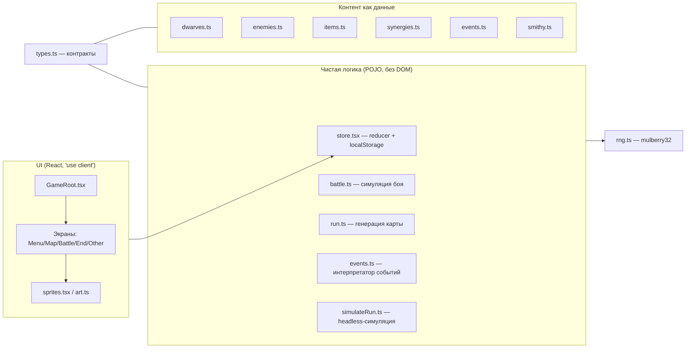

# Ревью проекта «Гномы и Глубины»

> Дата: 2026-10-01
> Объём: код-ревью (архитектура, логика, данные, UI, инфраструктура, тесты)
> Статусы пунктов: 🔴 критично · 🟠 инфраструктура · 🟡 качество · 🟢 мелочи

Idle-roguelite auto battler на Next.js 16 + React 19 + TypeScript. Весь игровой стейт —
в `localStorage`, бой — детерминированная пошаговая симуляция на RNG `mulberry32`.

---

## 1. Архитектура

Разделение «логика/рендер» выдержано строго: [`battle.ts`](src/lib/game/logic/battle.ts:1),
[`run.ts`](src/lib/game/logic/run.ts:1) и [`events.ts`](src/lib/game/logic/events.ts:1)
не трогают DOM — headless-прогон в тестах работает честно.

Слои:

| Слой | Файлы | Ответственность |
|---|---|---|
| Контракты | [`types.ts`](src/lib/game/types.ts:1) | единственный источник истины данных |
| Контент | [`data/`](src/lib/game/data/) | таблицы гномов, врагов, предметов, событий, синергий, кузницы |
| Логика | [`logic/`](src/lib/game/logic/) | бой, карта, события, статы, headless-симуляция |
| Состояние | [`store.tsx`](src/lib/game/store.tsx:316) | reducer, персистентность, миграции сейвов |
| Рендер | [`components/game/`](src/components/game/) | экраны, спрайты, арт, фон |

---

## 2. Сильные стороны

- **Детерминизм**: seed забега → идентичный лог ([тест](src/lib/game/logic/simulateRun.test.ts:31));
  узлы солятся через `nodeSeed` ([store.tsx](src/lib/game/store.tsx:166)).
- **Культура документации**: комментарии с §-ссылками на ТЗ, [`defects.md`](defects.md:1)
  фиксирует отклонения среды, [`CHECKLIST.md`](CHECKLIST.md:1) — DoD по этапам.
- **Данные как данные**: гномы/враги/предметы/события/синергии/апгрейды кузницы —
  чистые таблицы, баланс правится без кода.
- **Валидация карты** с перегенерацией seed+1 и линейным fallback
  ([run.ts](src/lib/game/logic/run.ts:302)), BFS-проверка достижимости босса
  ([run.ts](src/lib/game/logic/run.ts:235)).
- **Миграция сейвов**: `normalizeMeta` / `normalizeRun` с дефолтами для новых полей
  ([store.tsx](src/lib/game/store.tsx:833)).
- **Процедурный пиксель-арт** без ассетов, dataURL-кэш ([art.ts](src/lib/game/art.ts:63)),
  SSR-заглушка через `BLANK_SPRITE`.
- **Тесты**: ~16+ unit-тестов инвариантов, миграций, эпичных финалов таймаута, баланса
  win rate ([battle.v69.test.ts](src/lib/game/logic/battle.v69.test.ts:1)).

---

## 3. Найденные проблемы

### 🔴 Критичные

| # | Проблема | Где | Статус |
|---|---|---|---|
| 1 | **Награда «+наследие» из события не выдаётся.** Выбор «Дать 5 золота» в «Заблудившемся гноме» списывает золото и обещает «+5 наследия (в конце забега)», но реализация — мёртвый код `run.floor += 0`; `legacyGain` не учитывает бонус событий. Игрок платит и не получает ничего | [`events.ts`](src/lib/game/logic/events.ts:150) → [`run.ts`](src/lib/game/logic/run.ts:420) | [ ] |
| 2 | **Сборка не проверяет типы.** `typescript.ignoreBuildErrors: true` — вопреки README («build — она же проверка типов»); любые type-ошибки молча проходят в прод | [`next.config.mjs`](next.config.mjs:30) | [ ] |

### 🟠 Инфраструктура / гигиена зависимостей

| # | Проблема | Где | Статус |
|---|---|---|---|
| 3 | **`lint` сломан**: `next lint` удалён в Next.js 16; flat-конфиг уже есть | [`package.json`](package.json:11) | [ ] |
| 4 | **Мёртвый груз**: игровой код не импортирует `@/components/ui/*` (0 результатов поиска); весь каталог `src/components/ui/` (~45 файлов) и тяжёлые зависимости (`recharts`, `react-hook-form`, `cmdk`, `vaul`, `sonner`, `input-otp`, `embla-carousel-react`, `react-day-picker`, `date-fns`, `@tanstack/react-query`, `zod`, `@hookform/resolvers`, `react-resizable-panels`, ~30 пакетов `@radix-ui/*`) не используются | [`src/components/ui/`](src/components/ui/) · [`package.json`](package.json:13) | [ ] |
| 5 | **Артефакты шаблона**: мёртвая server action; `gnomes_seen_v1` пишется, но не читается; имя пакета `nextjs-base`; CSP `frame-ancestors *` | [`actions.ts`](src/app/actions.ts:3) · [`GameRoot.tsx`](src/components/game/GameRoot.tsx:24) · [`next.config.mjs`](next.config.mjs:12) | [ ] |

### 🟡 Качество кода / риски

| # | Проблема | Где | Статус |
|---|---|---|---|
| 6 | **Дублирование taunt-логики**: `initTaunt` в BattleScreen копирует пре-цикл `simulateBattle` — риск расхождения при правках | [`BattleScreen.tsx`](src/components/game/BattleScreen.tsx:80) ↔ [`battle.ts`](src/lib/game/logic/battle.ts:424) | [ ] |
| 7 | **JSON-clone в горячем цикле**: `clone()` на каждый `simulateTurn` + накопление лога дают O(n²) копирование на боях ~100 раундов | [`battle.ts`](src/lib/game/logic/battle.ts:32) | [ ] |
| 8 | **Хрупкий соль по id узла**: `nodeSeed` парсит `f{n}n{i}` регуляркой — смена формата id молча деградирует до `node.floor` и ломает воспроизводимость | [`store.tsx`](src/lib/game/store.tsx:167) | [ ] |
| 9 | **Доступ к приватному полю**: `p['cells']` обходит приватность `Px.cells` — нужен аксессор | [`art.ts`](src/lib/game/art.ts:80) | [ ] |
| 10 | **Мёртвый код в событиях**: `sumGold` — бессмысленная обёртка над `run.gold`; условие с `\|\|` избыточно | [`events.ts`](src/lib/game/logic/events.ts:16) | [ ] |

### 🟢 Документация / мелочи

| # | Проблема | Где | Статус |
|---|---|---|---|
| 11 | **README расходится с реальностью**: шрифты (`runic-mine.ttf` + bold vs только `DeepGlyph.ttf` 400); нет скрипта `test` в package.json; «размер отряда 1→3» при дефолте `maxPartySize: 2` | [`README.md`](README.md:70) · [`layout.tsx`](src/app/layout.tsx:9) · [`package.json`](package.json:6) | [ ] |
| 12 | **Мелочи баланса**: руна-`extra_slot` работает по принципу «курица и яйцо»; в `BATTLE_FINISH` расходы RNG разных сущностей смешаны на одном `nodeSeed` | [`stats.ts`](src/lib/game/logic/stats.ts:43) · [`store.tsx`](src/lib/game/store.tsx:413) | [ ] |

---

## 4. Приоритетные рекомендации

1. **Починить баг с «наследием из события»** — добавить бонус в `RunState`/`legacyGain`
   либо убрать награду (проблема №1).
2. **Убрать `typescript.ignoreBuildErrors`**, починить `lint`, подключить проверку типов
   и линта в pre-commit/CI (№2, №3).
3. **Вычистить `src/components/ui/*` и неиспользуемые зависимости** — минус ~50% `node_modules`
   и заметное ускорение сборки (№4).
4. **Вынести taunt-логику и `clone` из hot-path**, заменить regex-соль полями узла (№6–№8).
5. **Удалить мёртвый код** (`actions.ts`, `gnomes_seen_v1`, `sumGold`) и привести README
   и package.json в соответствие (№5, №10, №11).

---

## 5. Итог

Архитектурно проект сильный: чистая детерминированная логика, data-driven контент,
отличная документация отклонений и тесты инвариантов. Основные претензии — один
функциональный баг наград (№1), отключённая проверка типов в сборке (№2) и заметный
объём мёртвого кода/зависимостей, унаследованный от шаблона (№4–№5).